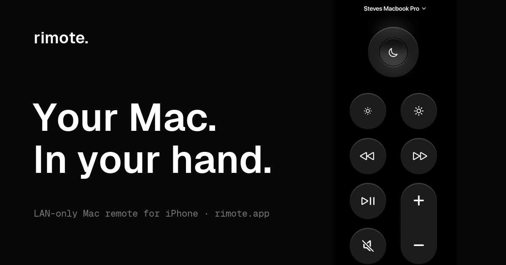

<div align="center">


# Rimote

**Use your iPhone as a remote for your Mac.**<br/>
**Nothing ever leaves your Wi-Fi.**

[](https://github.com/sfs016/rimote-mac/releases/latest)
[](https://github.com/sfs016/rimote-mac/releases)
[](https://github.com/sfs016/rimote-mac/releases/latest/download/Rimote.dmg)
[](https://apps.apple.com/app/id6779406773)
[](LICENSE)

**[⬇&nbsp;&nbsp;Download Rimote.dmg](https://github.com/sfs016/rimote-mac/releases/latest/download/Rimote.dmg)** &nbsp;·&nbsp; [iPhone app on the App&nbsp;Store](https://apps.apple.com/app/id6779406773) &nbsp;·&nbsp; [rimote.app](https://rimote.app)

<a href="https://rimote.app"></a>

</div>

Sleep, lock, volume, mute, media transport, brightness, and a directional
clickpad for Keynote — from a SwiftUI iPhone app to a Mac menu-bar agent, over
a direct WebSocket on your local network. No cloud, no accounts, no telemetry.
The `.dmg` is signed and notarized by Apple.

## Install

1. [Download Rimote.dmg](https://github.com/sfs016/rimote-mac/releases/latest/download/Rimote.dmg) and drag **Rimote** to Applications. It lives in the menu bar, not the Dock.
2. Open the [iPhone app](https://apps.apple.com/app/id6779406773), pick your Mac, and type the 4-digit PIN shown in the menu-bar popover. Done — paired forever.

Grant **Accessibility** when prompted (System Settings → Privacy & Security) —
it's needed for media, brightness, and arrow keys. Sleep, lock, and volume work
without it.

## How it works

```
iPhone (SwiftUI)  ──WebSocket :8765──▶  Mac agent (NWListener)  ──▶  macOS
  Bonjour browse       JSON + token         command whitelist       pmset / osascript /
  URLSessionWS         10s heartbeat        constant-time auth      CGEvent media keys
```

- **Zero-config discovery.** The agent advertises `_rimote._tcp` over Bonjour; the phone finds it by name. No IP addresses.
- **Event-driven, zero polling.** State (volume, mute, battery) is pushed on connect and after each change — idle CPU is ~0%.
- **One frozen wire contract.** Both apps implement [PROTOCOL.md](PROTOCOL.md): pairing handshake, message shapes, and the action whitelist.

## Security model

- **Hardcoded command whitelist.** The agent executes only the fixed cases of one Swift enum ([RemoteAction.swift](Rimote/Protocol/RemoteAction.swift)). No request string ever reaches a shell — commands run as an absolute executable plus an argument array, never `sh -c`.
- **PIN → token auth.** A one-time 4-digit PIN (60-second expiry) bootstraps a 256-bit token, stored `0600` and verified in **constant time on every message** ([TokenStore.swift](Rimote/Pairing/TokenStore.swift)).
- **LAN-only by design.** The agent opens zero internet connections. "Forget Paired Device" deletes the token immediately.

## Build from source

```bash
git clone https://github.com/sfs016/rimote-mac.git && cd rimote-mac
xcodebuild -project Rimote.xcodeproj -scheme Rimote -configuration Release build
```

Or open `Rimote.xcodeproj` in Xcode (15+) and run. Verify it's advertising:
`dns-sd -B _rimote._tcp`

To produce an installable image, `Scripts/build-dmg.sh` builds `dist/Rimote.dmg`
— ad-hoc signed by default, Developer ID-signed and notarized automatically when
signing credentials are present in the environment.

## Testing

```bash
Tests/run-e2e.sh
```

A 16-check end-to-end suite that builds and launches the **real agent binary**
in an isolated throwaway environment, then drives the full protocol over an
actual WebSocket: pairing, token issuance, live status push, a self-restoring
command, and rejection of a bad token. See [Tests/README.md](Tests/README.md).

## Limitations

- Same Wi-Fi network only; no remote access, by design. A sleeping Mac can't be woken over the network.
- Networks that block Bonjour/mDNS (some enterprise Wi-Fi) break discovery.
- Brightness is a blind ± (macOS doesn't reliably report the level back).

## License

[MIT](LICENSE) © 2026 Farhaj Shahid
